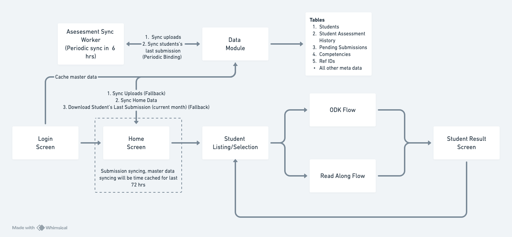

# Assessments

## Assessment Flow Engine
The Assessment Flow Engine is a robust and flexible library designed to manage complex, multi-step assessment processes within Android applications. It provides a structured and database-driven approach to orchestrating assessments, handling different assessment modules, managing state, and ensuring data integrity. This library is built with modern Android development practices in mind, leveraging Room, Coroutines, and StateFlow for a reactive and efficient experience.

## Core concepts
### 1. Assessment Journey as a Directed Graph
- The library models an assessment as a directed graph, where each node represents a step in the assessment process.
- Each step is defined by an AssessmentState object, which encapsulates the necessary information for that step.
- The library manages the transitions between these steps, ensuring a smooth and logical flow.

### 2. Database-Driven State Management:
- The AssessmentState entity, persisted in a Room database, is the central data structure for managing the assessment flow.
- The stateStatus field within AssessmentState acts as the core of a state machine, tracking the progress of each assessment step.
- This database-centric approach ensures data persistence, fault tolerance, and the ability to resume assessments after interruptions.

### 3. Modular Assessment Design:
- The library supports a modular design, allowing you to integrate different assessment modules (e.g., ODK, Read Along) seamlessly.
- The flowType field in AssessmentState determines which module is launched for a given step.
- This modularity makes it easy to extend the library with new assessment types in the future.

### 4. Reactive and Asynchronous Operations:
- The library leverages Kotlin Coroutines for asynchronous operations, ensuring that the UI remains responsive.
- StateFlow is used to emit state changes, allowing the UI to react to changes in the assessment flow in a reactive manner.

### 5. Data Integrity:
- The library uses foreign keys to maintain data integrity. Key Components

### 6. AssessmentState Entity:
- **Purpose**: Represents a single step in the assessment process.
- **Key Fields**:
    - studentId: The ID of the student (foreign key).
    - refIds: A list of reference IDs for the assessment module.
    - competencyId: The ID of the competency being assessed (foreign key).
    - flowType: The type of assessment module (e.g., ODK, BOLO).
    - result: The result of the assessment step (JSON string).
    - stateStatus: The current status of the step (PENDING, COMPLETED, CANCELLED).
- **Database Table:** assessment_state

### 7. AssessmentFlowVM (ViewModel):
**Purpose**: The core engine that orchestrates the assessment flow.
**Responsibilities**
    - Configuring the assessment based on metadata and user roles.
    - Creating and persisting AssessmentState objects.
    - Observing the assessment_state table for changes.
    - Determining which assessment module to launch next.
    - Processing results from assessment modules.
    - Updating AssessmentState objects in the database.
    - Managing the overall state of the assessment.
    - Generating scorecard data.
    - Handling errors and cancellations.

**Conceptual API:**
    - initFlow(grade, studentId, schoolData): Initializes the assessment flow.
    - processAssessmentResult(result): Processes the result from an assessment module.
    - moveToResults(): Triggers the navigation to the scoreboard.
    - abandonFlow(): Cancels the assessment flow.
    - eventsState: A StateFlow that emits the current AssessmentFlowState.