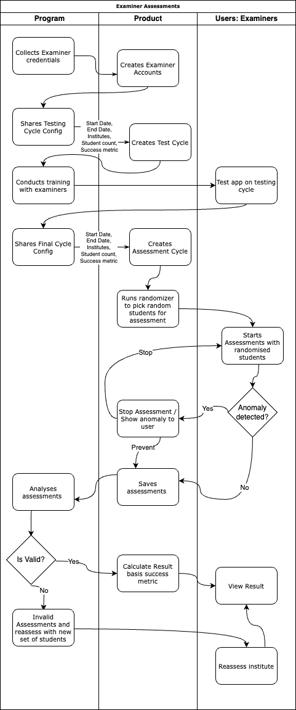

# Examiner Assessment Cycle Management Process

This document outlines the steps for managing an examiner cycle, including creating an assessment cycle, mapping schools to the cycle, setting up a randomizer for student selection, invalidating existing examiners, adding new examiners, mapping examiners to districts, and handling any issues related to examiners and assessments fraud .

### Key Concepts

- **Mentor**: The person who takes on the role of the examiner. The mentor is responsible for evaluating schools to determine whether they meet the NIPUN (National Initiative for Proficiency in Reading with Understanding and Numeracy) standards.
  
- **Cycle**: A specific time period during which the examiner is authorized to assess schools. The cycle includes parameters such as the number of students to be assessed in each grade and the target NIPUN percentage.

- **Cycle School Mapping & Randomizer Setup**: After creating an assessment cycle, schools are mapped to the cycle using their UDISE codes. The randomizer selects a specified number of students per grade from the mapped schools based on the counts provided during cycle creation.

- **District Examiner Mapping**: This process involves mapping examiners (mentors) to specific districts within the assessment cycle. The examiner can assess any school within their assigned district during the cycle.

- **SOS Reporting**: If an examiner is pressured to falsely mark a school as NIPUN, they have the option to mark the school as SOS (emergency alert) after the assessment. This action triggers an investigation or further review.

- **Invalidating Examiner Assessments**: If there are issues or inaccuracies in the examiner's assessments, their assessments can be invalidated. If necessary, the examiner can also be removed from the assessment cycle.

### User Flow

1. **Add Mentor (Examiner)**: The mentor is added to the system, providing details such as phone number, district assignment, block assignment, designation, UDISE code, and area type. The mentor's role as an examiner is specified with an `actor_id` of 2.

2. **Create Assessment Cycle**: An assessment cycle is created with a specific name, start and end dates, the number of students to be assessed in each grade, and the target NIPUN percentage. This cycle defines the time period during which assessments will be conducted.

3. **Cycle School Mapping & Randomizer Setup**: Schools are mapped to the created assessment cycle using their UDISE codes. The randomizer selects a specific number of students from each grade to participate in the assessment, based on the parameters set during the cycle creation.

4. **District Examiner Mapping**: The examiners (mentors) are mapped to districts within the assessment cycle. This allows the examiner to assess any school within their assigned district during the cycle.

5. **Mark School Result SOS**: After completing a school assessment, if the examiner is forced to falsely mark the school as NIPUN or suspects fraud, they can mark the school as SOS. This action alerts the system to potential fraud, triggering an investigation.

6. **Invalidate Examiner Assessments**: If there are any issues or errors in the examiner's assessments, the assessments can be invalidated. The system can either reset all assessments and reassign the UDISE cycle mapping or delete the examiner's assessments and remove them from the cycle.

   **Below is the user flow diagram**:- 

   


## Table of Contents

1. [Creating an Assessment Cycle](#creating-an-assessment-cycle)
2. [Cycle School Mapping & Randomizer Setup](#cycle-school-mapping--randomizer-setup)
3. [Invalidating Existing Examiners & Adding New Examiners](#invalidating-existing-examiners--adding-new-examiners)
4. [District Examiner Mapping](#district-examiner-mapping)
5. [Mark School Result SOS](#mark-school-result-sos)
6. [Invalidate Examiner Assessments](#invalidate-examiner-assessments)

---

## Creating an Assessment Cycle

To create an assessment cycle, use the following cURL command. Replace `<admin-token>` and `{{nl_baseUrl}}` with your actual admin token and URL.

```bash
curl --location '{{nl_baseUrl}}/admin/assessment-cycle' \
--header 'Authorization: Bearer <admin-token>' \
--header 'Content-Type: application/json' \
--data '{
    "name": "Test Cycle (1 Sep - 30 Sep)",
    "start_date": "2024-09-01",
    "end_date": "2024-09-30",
    "class_1_students_count": 5,
    "class_2_students_count": 9,
    "class_3_students_count": 10,
    "nipun_percentage": 75
}'
```

### Parameters:
- `name`: Name of the assessment cycle, e.g., "Test Cycle (1 Sep - 30 Sep)".
- `start_date`: The start date of the cycle in `YYYY-MM-DD` format.
- `end_date`: The end date of the cycle in `YYYY-MM-DD` format.
- `class_1_students_count`: Number of students to be assessed from Class 1.
- `class_2_students_count`: Number of students to be assessed from Class 2.
- `class_3_students_count`: Number of students to be assessed from Class 3.
- `nipun_percentage`: Percentage of students expected to achieve proficiency (NIPUN).

---

## Cycle School Mapping & Randomizer Setup

After creating an assessment cycle, map schools to the cycle using their UDISE codes, and set up the randomizer to select students for assessment. Use the following cURL command to map schools. Replace `<admin-token>` and `{{nl_baseUrl}}` with your actual admin token and URL.

```bash
curl --location '{{nl_baseUrl}}/admin/assessment-cycle/<cycle_id>/district-school-mapping' \
--header 'Authorization: Bearer <admin-token>' \
--header 'Content-Type: application/json' \
--data '[
    {
        "udise": <school_udise>
    }
]'
```

### Parameters:
- `cycle_id`: The ID of the assessment cycle created.
- `school_udise`: The UDISE code of the school to be mapped.

The randomizer in the API will select a specified number of students per grade from the mapped schools based on the counts provided during the cycle creation.

---

## Invalidating Existing Examiners & Adding New Examiners

To manage examiners, you can either invalidate all existing examiners and add new ones in bulk or add individual examiners.

### Invalidate All Existing Examiners and Add Bulk Examiners

For instructions on invalidating all existing examiners and adding new ones in bulk, follow the documentation at [bulk-examiner-ingestion doc](./scripts/bulk-examiner-ingestion.md).

### Add a New Examiner Individually

To add a new examiner individually, use the following cURL command. Replace `<admin-token>` and `{{nl_baseUrl}}` with your actual admin token and URL.

```bash
curl --location '{{nl_baseUrl}}/admin/mentor' \
--header 'Authorization: Bearer <admin-token>' \
--header 'Content-Type: application/json' \
--data '{
    "phone_no": <phone_no>,
    "district_id": <district_id>,
    "block_id": <block_id>,
    "designation_id": <designation_id>,
    "actor_id": 2,
    "udise": <udise>,
    "area_type": <area_type>,
    "officer_name": <officer_name>
}'
```

### Parameters:
- `phone_no`: Phone number of the examiner.
- `district_id`: ID of the district the examiner is assigned to.
- `block_id`: ID of the block the examiner is assigned to.
- `designation_id`: Designation ID of the examiner.
- `actor_id`: ID representing the examiner's role which is `2`.
- `udise`: UDISE code of the school the examiner is assigned to.
- `area_type`: Type of area the examiner will cover (e.g., urban, rural).
- `officer_name`: Name of the officer assigned as the examiner.

---

## District Examiner Mapping

Once the examiners are set up, map them to specific districts using the following cURL command. Replace `<admin-token>` and `{{nl_baseUrl}}` with your actual admin token and URL.

```bash
curl --location '{{nl_baseUrl}}/admin/assessment-cycle/<cycle_id>/district-examiner-mapping' \
--header 'Authorization: Bearer <admin-token>' \
--header 'Content-Type: application/json' \
--data '[
    {
        "mentor_id": <mentor_id>,
        "district_id": <district_id>
    }
]'
```

### Parameters:
- `cycle_id`: The ID of the assessment cycle.
- `mentor_id`: The ID of the examiner.
- `district_id`: The ID of the district to which the examiner is assigned.

---

## Mark School Result SOS

If there is pressure or an attempt to fraudulently mark a school result as NIPUN, the examiner has the option to mark the school result as SOS (emergency alert). After completing a school assessment, the examiner will see an SOS button on the school listing page. If the examiner is coerced or suspects foul play, they can mark the school as SOS using this button. This action reports the school for potential fraud, triggering an investigation or further review.

If there is pressure or an attempt to fraudulently mark a school result as NIPUN, use the following cURL command to mark the school result as fraud. Replace `<examiner_token>` and `{{nl_baseUrl}}` with your actual examiner token and URL.

```bash
curl --location --request POST '{{nl_baseUrl}}/api/school/<udise>/result/report/fraud?cycle_id=<cycle_id>' \
--header 'Authorization: Bearer <examiner_token>'
```

### Parameters:
- `udise`: The UDISE code of the school to report.
- `cycle_id`: The ID of the assessment cycle.
- `examiner_token`: Token of the examiner raising the SOS.

This action marks the result of the school as fraudulent for the given cycle, allowing the system to address the issue.

---

## Invalidate Examiner Assessments

To invalidate examiner assessments, use the following cURL command. Replace `<admin-token>` and `{{nl_baseUrl}}` with your actual admin token and URL.

```bash
curl --location '{{nl_baseUrl}}/admin/assessment-cycle/<cycle_id>/invalidate-examiner-assessments' \
--header 'Authorization: Bearer <admin_token>' \
--header 'Content-Type: application/json' \
--data '{
    "udises":  ["<list of udise to invalidate result>"],
    "reset_all": true,
    "delete_all": false,
    "mentor_id": "000"
}'
```

### Parameters:
- `udises`: A list of UDISE codes to invalidate.
- `reset_all`: When set to `true`, it invalidates all assessments of the given mentor and UDISE, deletes UDISE cycle mapping, and recreates the UDISE cycle mapping with random students.
- `delete_all`: When set to `true`, it invalidates all assessments of the given mentor, deletes UDISE cycle mapping, and removes the examiner from the assessment cycle.

---

This process ensures effective management of the assessment cycle, accurate and fair evaluation of students, and proper handling of any issues related to examiners and assessments.
