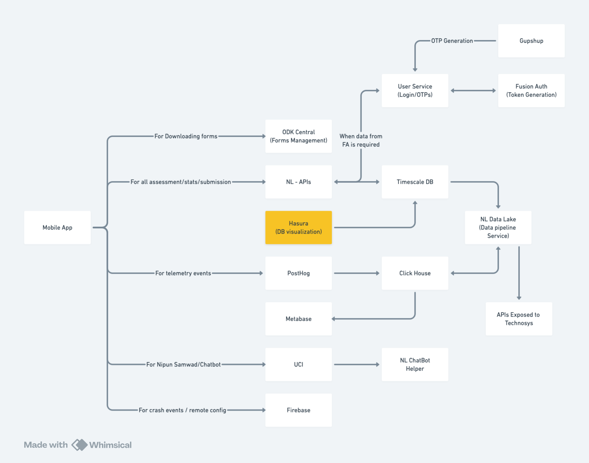

# Overview
---
A brief overview of the Nipun Lakshya App and its role in empowering foundational education in Uttar Pradesh.
---

# Nipun Lakshya App

The **Nipun Lakshya App** is a digital solution developed by the Department of Basic Education, Uttar Pradesh, under the NIPUN Bharat Mission. Designed primarily for Grades 1 to 3, the app helps mentors and teachers conduct quick, standardized spot assessments to measure students’ reading fluency, comprehension, and basic arithmetic skills.

## Ecosystem

Below is a diagram that illustrates the complete ecosystem of the Nipun Lakshya App. This diagram encompasses all backend services and data integrations that power the application.

## What It Does

- **Real-Time Assessments:**  
  Empowers teachers and mentors to evaluate students’ proficiency during school visits, enabling immediate feedback and targeted interventions.

- **Offline-First Capability:**  
  Built to work seamlessly even in areas with poor internet connectivity, ensuring that assessments can continue without disruption.

- **Data-Driven Insights:**  
  Generates instant scorecards that help educators identify learning gaps and focus resources where they are most needed.

## Key Services

- **Spot Assessments:**  
  Quickly measure foundational literacy and numeracy skills using an intuitive interface and server-driven assessment engine.

- **Integration with Read Along:**  
  Leverages the Google Read Along (Bhashini) API to accurately assess oral reading fluency, even adapting to local dialects for better accuracy.

- **Scalable Deployment:**  
  Designed to support Uttar Pradesh’s vast network of over 4.5 lakh primary school teachers, ensuring reliable performance and robust data integration.

## Impact & Benefits

- **Enhanced Learning Outcomes:**  
  By providing real-time data, the app helps teachers focus on children who need additional support, thus improving overall learning levels.

- **Empowered Educators:**  
  Teachers gain a powerful tool to track progress, compare results over time, and make informed decisions on remedial actions.

- **Systemic Change:**  
  The app supports Uttar Pradesh’s ambitious target to achieve universal foundational literacy and numeracy by 2025–26, setting a replicable model for other states.

For more details on the broader mission, refer to the [NIPUN Bharat Mission](https://nipunbharat.education.gov.in) and recent coverage by news outlets like [The Times of India](https://timesofindia.indiatimes.com/city/lucknow/over-16k-state-run-primary-schools-in-uttar-pradesh-achieve-fln-and-become-nipun/articleshow/107838701.cms).

---
